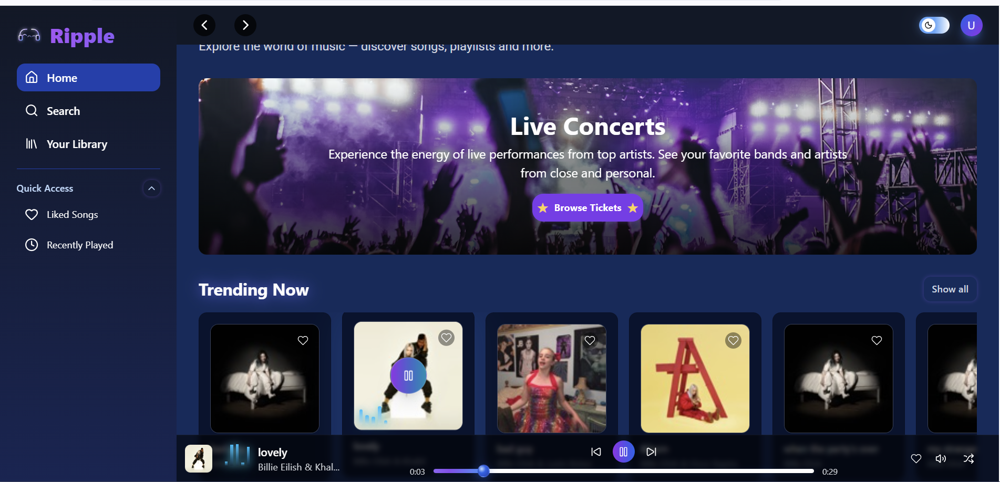
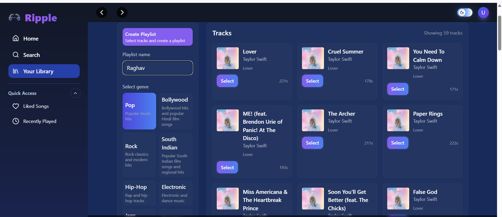
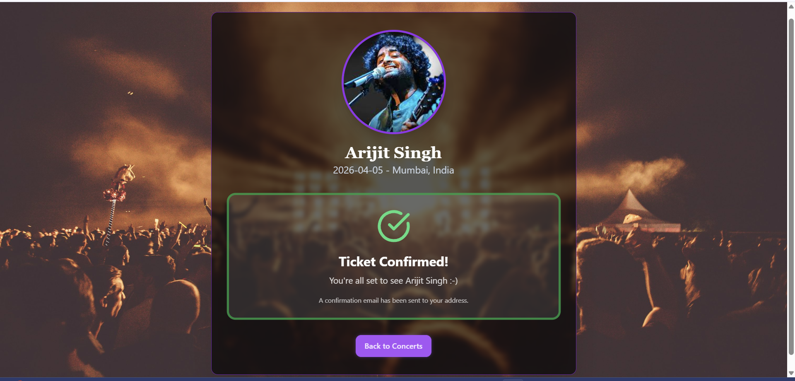
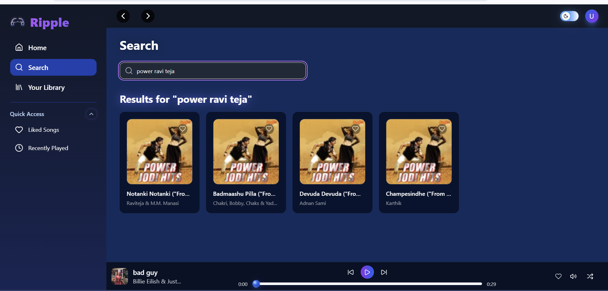

##  Ripple: Online Music Streaming Platform   
Ripple is a modern, production-ready **online music streaming web application** that delivers a seamless listening experience with a clean and intuitive user interface. Built with **React Redux**, **TypeScript**, **Vite**, and **Tailwind CSS** and powered by **Firebase** for authentication and cloud storage, MusicMania combines cutting-edge web technologies with real-world music streaming features.  

The platform provides users with the ability to **stream songs, explore genres, book live concerts of their favorite singers and manage personal libraries**, all while enjoying a smooth, responsive and reliable performance across devices.  

With features like **dark/light mode**, **offline support** and a modular **component-driven UI system**, it is designed to scale from small projects to enterprise-grade deployments. Its **cloud-first architecture** ensures persistent user preferences, secure authentication, and real-time updates, making it both developer-friendly and user-focused.  

Whether you’re a music lover exploring playlists or a developer looking for a robust streaming app boilerplate, Ripple is built to impress.  

---
> Website Live: [Click here](https://musicmania-7dplxa9y8-raghabendra-dash-projects.vercel.app/)
---

### ✨ Features  

- ▶ **Stream Songs** – Play music online with high-quality streaming.  
- 💽 **Discover Genres** – Browse and explore songs by categories like Pop, Rock, Jazz, Classical, etc.  
- 🧑‍🎤 **Book Live Concerts** – Reserve tickets for concerts of famous singers directly from the platform.  
- 📂 **Personal Library** – Create and manage your playlists and favorite tracks.  
- 🔐 **Secure Authentication** – Firebase-based login and signup system.  
- ☁️ **Cloud Storage** – Songs, preferences, and user data stored securely in the cloud.  
- 🌙 **Dark & Light Mode** – Adaptive UI themes for better user experience.  
- 📱 **Responsive Design** – Fully optimized for mobile, tablet, and desktop devices.  
- 🛎️ **Offline Support** – Access saved songs and preferences even without internet.  
- 🕹️ **Developer-Friendly Setup** – Clean folder structure and modular React components.  

---

### 📸 Screenshots    

### 📀 Home Page  
  

### ⏯ Genres & Playlists  
  

### 🧑‍🎤 Concert Booking Page  
  

### 📁 Search Library  
  

---

### 🚀 Tech Stack  

- **Frontend:** React 18, TypeScript, Vite, Tailwind CSS  
- **Backend / Cloud:** Firebase Authentication & Firestore  
- **UI Components:** Reusable React functional components  
- **Build & Tooling:** ESLint, Prettier, Vite for fast builds  

---

### ⚙ Installation

1. Clone the repository
 
 ```bash
 git clone https://github.com/your-username/musicMania.git
 cd musicMania
 ```
2. Install dependencies
 
 ```bash
  npm install
 ```
3. Run the development server

 ```bash
 npm run dev
 ```

### 💼 Business Value

 Ripple is not just a streaming app – it’s a scalable digital product with real business impact:

- 🎤 New Revenue Streams – Concert booking integration creates direct ticketing revenue opportunities.

- 👥 User Engagement – Personalized libraries, playlists, and genre discovery increase retention.

- 📈 Market Expansion – Cross-device responsive design ensures reach to wider audiences (mobile-first users).

- 🤝 Partnership Potential – Can integrate with record labels, artists, and event organizers for collaborations.

- 🔒 Trust & Security – Firebase-based authentication ensures secure handling of user data, essential for business credibility.

- 🌍 Global Scalability – Cloud-first architecture allows deployment for a large user base without performance issues.

### 🤝 Contributing

Contributions are welcome! Please fork the repo and submit a pull request with your changes.

### 📜 License

 This project is licensed under the MIT License.
